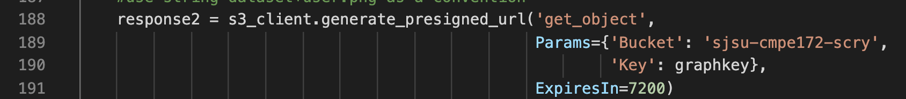

San Jose State University

Computer Engineering 172
Fall 2020

Written by:

	Nathan Hencky

	Andrew Murillo

	Bella Wei

Introduction

This a forecasting application for Enterprise.

The landing page looks like this.

Use the Navigation bar at the top of the window to navigate to Register or Login

Users can register and log in, and JWT authentication is used

Logged in users can view any products in the database, but only delete those they have added

Users can add products from their home screen when logged in.

REGISTRATION

LOGIN

HOME

To add a product, first click the "Add Product" button on the homepage

On the popup menu enter a Product Name and Description in the text boxes, then select a .csv or csv formatted .txt file to upload from your device after pressing the browse button
Press submit on the popup after adding Product Name, Description, and a History file.

Again, the file should be CSV formatted, and represent some history

THE QUANTITY TO FORECAST MUST BE IN THE FIRST COLUMN!!!!

Some sample history files from publicly available Wikipedia Web Traffic history are inlcuded in the test-files folder

Once a product has been successfully added to the database, a forecast can be retrieved for that data

After successfully adding a product, the product will appear in "card view" on the user's home page

That product card will have a "Get Forecast" button

Click the "Get Forecast" button to bring up the forecast menu

On the forecast menu just enter in an integer number of timesteps in the future you want to predict

For example, entering the number 7 will give you a forecast for 7 time steps after the last history entry

If your data is daily like in the test data, it will forecast for the 7 days occuring after the last entry in history

Press the submit button after entering an integer

The request will take about 30 seconds to 1 minute to process.

Loading Screen will look like this

The Machine Learning algorithm in the back-end trains on the historical data many times and validates its error during training
This lets us know the accuracy of our algorithm on when applied to historical data.
We train on a small section of the data, then make a prediction for the next period the model has not trained on yet, and record the error.
This is repeated several hundred times, adding more of the history as we go until we have trained on all of the history and recorded all the training errors.
Our forecast is not guaranteed to have the same accuracy, but this technique provides a good estimation of how accurate our forecasts should be

Once the training has finished, we use the trained model to predict the for the next period of time, with the length specified by the user on the forecast menu.

We graph the actual history, training predictions, and the requested forecast period.
We also create a chart of the individual forecasted period predictions and the average training error
These are displayed to the user on the forecast page.

After viewing their forecast, the user can return to the home page, where they can add more products, get more forecasts for other products, delete products that they have added or log out.
Because this application is targetted at Enterprises, all users can see all the products and get forecasts, but can only delete a product from the databse that they have added.

For more details see this link for a video of the Application running on a public url.
https://www.youtube.com/watch?v=ltJxAehc2JU&t=0s

Instructions for use

This repository contains all the source code to run the application in a Docker container, or without it.

The Dockerized build has a few lines of code that are different in the back-end.

scry_dev.py contains the back-end applciation code for running without Docker

scry_prod.py is used for the dockerized application

For the Dockerized build, the Front-end code uses a production optimized static build.

This means all of our React.JS application code is converted into static assets to be served by the Back-end rather than running 2 applications at the same time. 
We did run both applications together during development, and all the original development files are inlcuded as well.

To productionize the React.js application, we ran the command "npm run build", which creates a build folder with all the static assets generated from our React source code.

We then link the scry_prod.py to this build folder and serve the assets. This is far more efficient that running both applications in a production environment.

To avoid publishing our cloud security credentials, we have removed them from the application.

You will need to include your own SQL database and S3 bucker to use this application

There is no database schema script, as the SQLAlchemy package we use takes care of that.

You can use a link to any database schema.

The first time you run the application you need to inlclude the command "db.create_all()"

This will create the tables defined by the Objects in models.py that map to the database

We have included this db.create_all in the first line in the route "/api/register", so that when you register your first user, the tables are created first.

After registering this first user, the tables will be created.

YOU WILL THEN NEED TO GO AND COMMENT OUT THE LINE db.create_all() !!!!!!!!!
<find line, add image>

This will prevent the tables from being recreated every time you run the application

1. Download or pull the project source code from Github

2. Navigate to the project root folder

3. Add your own MySQL database connection to the application in line 24 of scry_prod.py

	
	
	replace username with your database username

	replace password with your database password

	replace url with the url for your database

	replace port with the port number your database connection uses (probably 3306)

	replace schema with any new schema you create in your database - you want an empty one

4. Add your own AWS credentials at lines 100 - 101 in scry_prod.py. The key values need to be surrounded by quotes.
	

Repeat this at lines 286 - 287
	

5. Add your own S3 bucket name at line 103 of scry_prod.py replacing sjsu-cmpe-172 with your own bucket
	

Lines 186, 189, ans 291 also need to have the same bucket name added in the same way
	
	

5. Run the build script with the command:
./build.sh
6. When this has finished building run the run script
./run.sh
7. Click the link in console or manually navigate to 0.0.0.0:5000 in Firefox or Chrome browser

The application should be running, but will have no data yet.
You will need to register a new user on the register screen
Adding a product can be done using the files in the test-files folder

